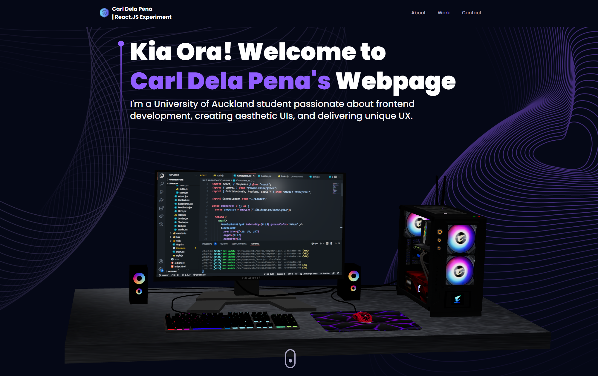

# ThreeJS Landing Page Experiment by Carl with the help of Youtube Tutorial from JavaScript Mastery

Experimented with React, TailwindCSS and ThreeJS with the help of a YouTube tutorial from "JavaScript Mastery" to help me create this Landing page. 

Credit to JavaSctipt Mastery on YouTube : [YT Link To Original Portfolio by JS Mastery](https://www.youtube.com/watch?v=0fYi8SGA20k)

# Instructions

### step 1 : "npm install" on terminal within the main folder

### step 2 : "npm run dev" on terminal to run a server for the webpage to render

### step 3 : try spinning the 3D Model yourself!